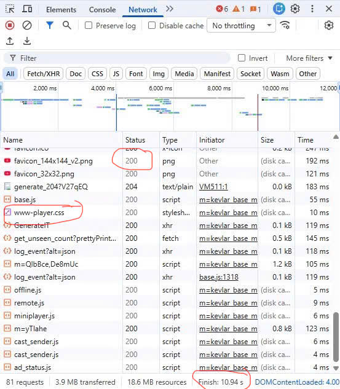

# PHẦN A — KIỂM TRA ĐỌC HIỂU (20 điểm)

## Câu A1 — HTTP & Browser
*Nguồn tham chiếu: 01_introduction_html_universe.md (Mục 0: Opening Hook, Mục 2: Client-Server Architecture & Mục 3: Browser Rendering Pipeline)*

**1. Các bước xảy ra khi nhập https://shopee.vn và nhấn Enter:**
Dựa theo luồng hoạt động Client-Server, quá trình này diễn ra qua 5 bước chính như sau:

* **Bước 1: DNS Lookup & Định tuyến:** Trình duyệt phân giải tên miền `shopee.vn` thành địa chỉ IP, sau đó request xuất phát từ máy tính, đi qua các tầng mạng (nhà mạng, cáp quang) để tìm đến máy chủ (Server) của Shopee.
* **Bước 2: Gửi HTTP Request (Client to Server):** Trình duyệt (Client) đóng vai trò người hỏi, gửi một HTTP Request (sử dụng method `GET`) đến máy chủ Shopee để yêu cầu nội dung trang web.
* **Bước 3: Nhận HTTP Response (Server to Client):** Máy chủ tìm kiếm dữ liệu, sau đó gửi trả lại một HTTP Response với Status Code (ví dụ: `200 OK`) kèm theo bộ ba file nền tảng: HTML, CSS và JavaScript.
* **Bước 4: Parsing (Phân tích cú pháp):** Trình duyệt nhận file HTML và bắt đầu đọc từ trên xuống (Parse HTML) để dựng lên DOM Tree (bộ xương). Đồng thời, nó tải về và đọc các file CSS (Parse CSS) để tạo CSSOM Tree.
* **Bước 5: Rendering (Dựng trang):** Trình duyệt thực thi JavaScript (Execute JS) nếu có. Cuối cùng, nó trải qua các bước Layout (tính toán vị trí) -> Paint (tô màu pixel) -> Composite để hiển thị giao diện hoàn chỉnh lên màn hình cho người dùng.

**2. Tab Network trong Chrome DevTools:**

Tab **Network** cho thấy toàn bộ lịch sử giao tiếp giữa Client và Server. Cụ thể, nó ghi lại mọi HTTP Request mà trình duyệt đã gửi đi để tải file (HTML, CSS, JS, ảnh...), kèm theo các thông tin chi tiết như: Status Code (200, 404...), Method (GET, POST...), dung lượng file và thời gian phản hồi của Server.

**[Ảnh Screenshot tab Network]**
*(Hình ảnh đính kèm: network.png)*


**Ghi chú các điểm đã đánh dấu trên ảnh:**
* **Status Code của request đầu tiên:** Nằm ở dòng trên cùng của danh sách tải (thường là request xin file HTML chính), có Status Code là `200` (OK).
* **Tổng thời gian load trang:** Nằm ở thanh trạng thái dưới cùng (ví dụ: hiển thị dòng chữ `Load: ... ms` hoặc `Finish: ... s`).
* **Một request trả về file CSS:** Nằm ở dòng yêu cầu có đuôi file là `.css` (ở cột Name) và cột Type hiển thị là `stylesheet`.

---

## Câu A2 (5đ) — Semantic HTML
*Nguồn tham chiếu: Chương 04 - PHẦN HIỂN THỊ (Mục 1: Why This Matters, Mục 2: Bản đồ <body>, Mục 3: Semantic Elements chi tiết & Mục 5: Real-world Layer)*

**1. Tại sao trang web bị Google đánh giá SEO thấp?**
Trang web này mắc lỗi "Div Soup" (chỉ sử dụng toàn thẻ `<div>` vô nghĩa). Theo tài liệu, khi bạn dùng Div Soup, "Google không phân biệt được gì". Các thẻ Semantic HTML ảnh hưởng trực tiếp đến SEO vì Google cần đọc các thẻ có ý nghĩa (như `<article>`, `<section>`, `<h1>`–`<h6>`) để hiểu cấu trúc nội dung của trang.

**2. Liệt kê 4 lỗi semantic và cách sửa:**
* **Lỗi 1:** Dùng `<div class="header">` cho phần đầu trang. Phải sửa thành `<header>`.
* **Lỗi 2:** Dùng `<div class="menu">` cho điều hướng. Phải sửa thành `<nav>`.
* **Lỗi 3:** Dùng `<div class="main">` và `<div class="product">`. Phải sửa thành `<main>` (chỉ dùng 1 lần cho nội dung chính) và `<article>` (cho nội dung độc lập của sản phẩm).
* **Lỗi 4:** Dùng `<div class="title">` cho tên sản phẩm. Cần sửa thành thẻ tiêu đề như `<h1>` (giống như ví dụ trang sản phẩm Shopee trong tài liệu) để Google nhận diện được.
* **Lỗi 5:** Thẻ `` thiếu thuộc tính `alt`. Thuộc tính `alt` bắt buộc phải có và phải mô tả nội dung ảnh để chuẩn SEO và người khiếm thị có thể hiểu.

**3. Đoạn code sửa lại chuẩn Semantic HTML:**

```html
<header>
    <div class="logo">ShopTLU</div>
    <nav class="menu">
        <ul>
            <li><a href="/">Trang chủ</a></li>
            <li><a href="/products">Sản phẩm</a></li>
        </ul>
    </nav>
</header>
<main>
    <article class="product">
        <h1 class="title">iPhone 16 Pro</h1>
        <p class="price">25.990.000đ</p>
        <figure class="image">
            
        </figure>
    </article>
</main>
<footer>
    &copy; 2026 ShopTLU
</footer>
```

---

## Câu A3 — Block vs Inline
**Text Art minh họa:**

```text
[-------------------------- Hộp 1 --------------------------]
[Text A] [Text B]
[-------------------------- Hộp 2 --------------------------]
[Text C] [**Text D**]
[-------------------------- Hộp 3 --------------------------]
```
Trên trình duyệt, các phần tử sẽ được xếp chồng lên nhau và nối tiếp nhau theo cấu trúc sau (khung ngoặc vuông [ ] biểu diễn không gian mà phần tử chiếm dụng)
---
---

## Câu A4 — Table
*Nguồn tham chiếu: File 05_tables_hyperlinks.md (Chương 05) - Phần 3: Core Technical Truth & Phần 5: Real-world Layer.*

**1. Sự khác nhau giữa `<thead>`, `<tbody>`, `<tfoot>`:**
Theo tài liệu, đây là các thẻ Semantic dùng để phân định rõ cấu trúc của một bảng dữ liệu (`<table>`), giúp trình duyệt, CSS và trình đọc màn hình (cho người khiếm thị) xử lý tốt hơn:
* **`<thead>` (Header section):** Dùng để chứa phần tiêu đề của bảng. Thông thường bên trong sẽ chứa các thẻ `<th>` để hiển thị tên các cột một cách nổi bật (in đậm và căn giữa).
* **`<tbody>` (Data section):** Là "trái tim" của bảng, dùng để chứa toàn bộ nội dung hoặc các hàng dữ liệu chính. 
* **`<tfoot>` (Footer section):** Dùng để chứa các hàng tổng kết, tính tổng hoặc thông tin chú thích ở cuối bảng. 
* **Lợi ích kỹ thuật:** Khi dùng đúng 3 thẻ này, trình duyệt có khả năng hiển thị (render) phần đầu và phần cuối bảng trước ngay cả khi dữ liệu trong `<tbody>` đang tải (nếu bảng quá dài).

**2. Tại sao KHÔNG NÊN dùng table để tạo layout (bố cục) trang web?**
Việc sử dụng `<table>` để chia khung trang web (như tạo cột sidebar, header) là một cách làm cũ (anti-pattern) và không còn phù hợp vì 3 lý do sau:
* **Mất khả năng tiếp cận (Accessibility):** Phần mềm đọc màn hình sẽ đọc dữ liệu theo thứ tự hàng/cột. Nếu dùng table làm layout, nó sẽ đọc sai thứ tự logic của thông tin, gây khó khăn cho người khiếm thị.
* **Mã nguồn cồng kềnh (Abuse of code):** Bạn sẽ phải lồng ghép vô số thẻ `<tr>`, `<td>` chỉ để dịch chuyển một cái ảnh hay một dòng chữ, khiến file HTML trở nên nặng nề và cực kỳ khó sửa lỗi sau này.
* **Thiếu linh hoạt (Responsive kém):** Table rất "cứng nhắc". Việc làm cho một cái bảng co giãn mượt mà trên điện thoại di động là cực kỳ khó khăn so với việc sử dụng các công cụ hiện đại như **CSS Grid** hay **Flexbox**.
---

# PHẦN B — THỰC HÀNH CODE

## Câu B3 — Debug HTML
Dưới đây là danh sách các lỗi (Syntax và Semantic) được tìm thấy trong file mã nguồn và phương án sửa chữa:

* **Lỗi 1: Dòng 1 (Syntax)** — Khai báo `<!DOCTYPE>` thiếu chữ `html`. 
    * *Cách sửa:* Đổi thành `<!DOCTYPE html>`.
* **Lỗi 2: Dòng 2 (Semantic)** — Thẻ `<html>` thiếu thuộc tính ngôn ngữ `lang`. 
    * *Cách sửa:* Sửa thành `<html lang="vi">`.
* **Lỗi 3: Dòng 4 (Syntax)** — Thẻ `<title>` chưa được đóng. 
    * *Cách sửa:* Thêm thẻ đóng: `<title>Trang web</title>`.
* **Lỗi 4: Dòng 5 (Syntax)** — Giá trị charset viết sai định dạng chuẩn. 
    * *Cách sửa:* Đổi `"utf8"` thành `"utf-8"`.
* **Lỗi 5: Dòng 8 (Syntax)** — Thẻ đóng `<h1>` bị sai cú pháp (thiếu dấu `/`). 
    * *Cách sửa:* Đổi thành `</h1>`.
* **Lỗi 6: Dòng 12 (Syntax)** — Thẻ đóng `<a>` bị viết nhầm thành thẻ mở. 
    * *Cách sửa:* Đổi `<a>` ở cuối dòng thành `</a>`.
* **Lỗi 7: Dòng 19 & 26 (Semantic)** — Vi phạm phân cấp heading (nhảy từ `<h1>` xuống `<h3>`). 
    * *Cách sửa:* Đổi các thẻ `<h3>` thành `<h2>`.
* **Lỗi 8: Dòng 20 (Syntax & Semantic)** — Thuộc tính `src` thiếu ngoặc kép và thiếu thuộc tính `alt` mô tả ảnh. 
    * *Cách sửa:* Sửa thành ``.
* **Lỗi 9: Dòng 22 (Syntax)** — Lỗi lồng thẻ (Nesting error), đóng sai thứ tự `<b>` và `<p>`. 
    * *Cách sửa:* Đổi thành `<b>25.990.000đ</b></p>`.
* **Lỗi 10: Dòng 29 & 30 (Semantic)** — Dùng thẻ `<td>` cho tiêu đề cột thay vì thẻ chuyên dụng. 
    * *Cách sửa:* Đổi các thẻ `<td>` ở hàng đầu tiên thành `<th>`.
* **Lỗi 11: Dòng 40 (Semantic)** — Sử dụng quá một thẻ `<main>` trong một trang web. 
    * *Cách sửa:* Đổi cặp thẻ `<main>` thứ hai (phần sidebar) thành thẻ `<aside>`.
* **Lỗi 12: Dòng 45 (Syntax)** — Thẻ `<p>` trong khu vực footer chưa có thẻ đóng. 
    * *Cách sửa:* Thêm thẻ đóng `</p>` vào cuối dòng.
* **Lỗi 13: Dòng cuối cùng (Syntax)** — Thiếu thẻ đóng `</html>` cho toàn bộ tài liệu. 
    * *Cách sửa:* Thêm `</html>` vào sau thẻ `</body>`.
---

## Bài B4 — Phân tích trang web thật
**Trang web phân tích:** `thegioididong.com`

### 1. Phân tích tab Elements (Thẻ Semantic & Non-semantic)

**3 thẻ semantic HTML5 mà trang web sử dụng:**
* `<header>`: Nằm ở đầu trang, bao bọc toàn bộ khu vực logo, tìm kiếm và các menu điều hướng chính. Giúp trình duyệt và máy tìm kiếm nhận diện được phần đầu của website (Ghi nhận tại `anh1.png`).
* `<h1>`: Thẻ tiêu đề cấp 1, chứa nội dung quan trọng nhất của trang. Tại đây được ẩn đi bằng class `sc-only` nhưng vẫn tồn tại để hỗ trợ SEO (Ghi nhận tại `anh1.png`).
* `<form>`: Sử dụng để bao bọc các thành phần nhập liệu của ô tìm kiếm, giúp xử lý việc gửi dữ liệu lên máy chủ (Ghi nhận tại `anh3.png`).

**2 thẻ trang web KHÔNG dùng đúng semantic (Anti-pattern):**
* **Lạm dụng thẻ `<div>` (Div Soup):** Có quá nhiều thẻ `<div>` lồng nhau chỉ để làm lớp phủ hoặc hiệu ứng (như `header-overlay`, `header-mask`) mà không mang ý nghĩa nội dung thực tế (Ghi nhận tại `anh1.png`).
* **Dùng `<div>` làm nút bấm:** Trang web sử dụng `<div class="btn-view-more">` để làm chức năng "Xem thêm". Theo chuẩn semantic, chức năng này nên sử dụng thẻ `<button>` để hỗ trợ tốt hơn cho các thiết bị điều khiển bằng bàn phím hoặc trình đọc màn hình (Ghi nhận tại `anh2.png`).


---

### 2. Phân tích thẻ `<table>`

* **Table đó hiển thị nội dung gì?**
Dựa vào mã nguồn và ID của thẻ bao bọc (`div#product-comparison-table`), bảng này hiển thị **nội dung so sánh cấu hình và thông số kỹ thuật** giữa các sản phẩm điện thoại/thiết bị với nhau.
* **Có dùng `<thead>`, `<tbody>` không?**
Trong ảnh chụp, thẻ `<table>` đang được thu gọn. Tuy nhiên, theo quy tắc hiển thị của trình duyệt hiện đại, dữ liệu bên trong sẽ được tự động bao bọc bởi thẻ `<tbody>`. Với các bảng so sánh dạng cột đứng như trên trang web này, phần `<thead>` thường bị lược bỏ để tối ưu giao diện.


---

### 3. Phân tích thẻ `<form>` (Ô tìm kiếm)

* **Form đó có `action` và `method` gì?**
    * **`action`**: `"/tim-kiem"` (Dẫn người dùng đến trang xử lý kết quả tìm kiếm của hệ thống).
    * **`method`**: Thẻ `<form>` trong ảnh không ghi rõ thuộc tính này. Do đó, trình duyệt sẽ tự động áp dụng phương thức mặc định là **`GET`**. Điều này giúp từ khóa tìm kiếm hiển thị trực tiếp trên thanh địa chỉ URL.
* **Input types nào được dùng?**
Trang web sử dụng **`<input type="text">`** (đoạn mã: `type="text"`). Đây là kiểu nhập liệu phổ biến nhất, cho phép người dùng gõ văn bản tự do để tìm kiếm tên sản phẩm.

Trang web sử dụng <input type="text"> (hiển thị rõ qua đoạn mã <input id="skw" type="text"...>), giúp người dùng có thể gõ văn bản tự do để tìm kiếm thiết bị.


# PHẦN C - SUY LUẬN
## Câu C1 - Thiết kế cấu trúc
<header> <nav> <ul> <li><a href="/">Trang chủ</a></li>
            <li><a href="/products">Sản phẩm</a></li>
        </ul>
    </nav>
</header>

<main> <nav aria-label="breadcrumb"> <ol> <li><a href="/">Trang chủ</a></li>
            <li><a href="/dien-thoai">Điện thoại</a></li>
            <li><a href="/iphone-16" aria-current="page">iPhone 16</a></li>
        </ol>
    </nav>

    <article> <section> <figure> 
            </figure>
            <ul> <li></li>
                <li></li>
                <li></li>
                <li></li>
            </ul>
        </section>

        <section> <header> <h1>iPhone 16 Pro Max 256GB</h1> </header>
            
            <div class="rating"> <span>⭐⭐⭐⭐⭐</span> 
            </div>
            
            <p class="price">25.990.000đ</p> <div class="description"> <p>Mô tả chi tiết về tính năng và thiết kế của sản phẩm...</p> </div>
        </section>

    </article>

    <section> <h2>Thông số kỹ thuật</h2> <table> <tbody> <tr> <th scope="row">Màn hình</th> <td>6.7 inch, Super Retina XDR</td> </tr>
                <tr>
                    <th scope="row">Chip</th>
                    <td>Apple A18 Pro</td>
                </tr>
            </tbody>
        </table>
    </section>

    <section> <h2>Đánh giá từ khách hàng</h2>
        
        <article> <header>
                <h3>Nguyễn Văn A</h3> </header>
            <p>Sản phẩm dùng rất mượt, camera chụp đẹp!</p>
        </article>
        
        <article>
            <header>
                <h3>Trần Thị B</h3>
            </header>
            <p>Giao hàng nhanh, đóng gói cẩn thận.</p>
        </article>
    </section>

</main>

<aside> <h2>Sản phẩm tương tự</h2>
    <ul> <li>
            <article> 
                <h3>iPhone 15 Pro Max</h3>
                <p>23.000.000đ</p>
            </article>
        </li>
    </ul>
</aside>

<footer> <p>&copy; 2026 ShopTLU. All rights reserved.</p>
</footer>
---

## Câu C2 — So sánh & Tranh luận
**Phản biện quan điểm: "Dùng `<div>` cho mọi thứ rồi thêm class là được"**

Quan điểm "chỉ dùng thẻ `<div>` kết hợp class" (hay còn gọi là hiện tượng Div Soup) có thể giúp lập trình viên code nhanh hơn trong giai đoạn đầu, nhưng lại tạo ra một "khoản nợ kỹ thuật" khổng lồ. Semantic HTML không phải là lý thuyết suông mà là tiêu chuẩn bắt buộc của Web hiện đại vì những lý do cốt lõi sau:

**Thứ nhất, tối ưu hóa SEO:** Các bot của Google (Web Crawlers) hoàn toàn "mù" với CSS class. Một `<div class="main-content">` đối với bot chỉ là một chiếc hộp rỗng vô nghĩa. Ngược lại, khi sử dụng thẻ `<main>` hay `<article>`, bạn đang trực tiếp giúp máy tìm kiếm hiểu rõ đâu là nội dung trọng tâm cần lập chỉ mục, từ đó cải thiện đáng kể thứ hạng trang web.

**Thứ hai, tính tiếp cận (Accessibility - a11y):** Các phần mềm đọc màn hình cho người khiếm thị phụ thuộc hoàn toàn vào thẻ HTML để điều hướng. Nếu bạn dùng `<button>`, trình duyệt tự động hiểu đó là nút bấm và cho phép kích hoạt bằng phím Enter/Space. Nếu cố chấp dùng `<div class="btn">`, bạn sẽ phải tốn thêm rất nhiều thời gian viết JavaScript và thuộc tính ARIA phức tạp chỉ để mô phỏng lại một tính năng vốn đã có sẵn.

**Ví dụ thực tế chứng minh Semantic HTML giúp ích:** Hãy nhìn vào tính năng "Reader Mode" (Chế độ đọc) trên Safari hoặc Edge. Trình duyệt có thể tự động bóc tách nội dung chính của một bài báo và loại bỏ quảng cáo hoàn toàn nhờ việc bài viết đó được bọc trong thẻ `<article>`. Nếu trang web chỉ dùng `<div>`, trình duyệt sẽ bất lực trong việc trích xuất nội dung.

**Trường hợp thẻ `<div>` vẫn phù hợp:** Mặc dù vậy, Semantic HTML không đào thải thẻ `<div>`. Thẻ `<div>` vẫn cực kỳ hoàn hảo khi dùng để **gom nhóm các phần tử thuần túy phục vụ cho mục đích giao diện (layout/styling)** mà không mang ý nghĩa ngữ nghĩa. Ví dụ: Dùng `<div class="grid-container">` để dàn bố cục các thẻ `<article>` thành dạng lưới, hoặc `<div class="overlay">` để tạo lớp nền tối mờ phía sau một popup.
